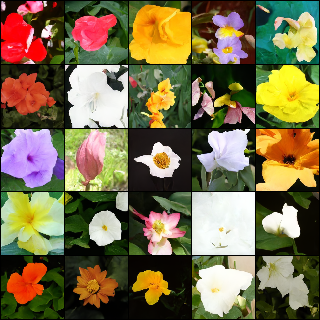

# Denoising Diffusion Probabilistic Model, in MindSpore

</img>

Implementation of [Denoising Diffusion Probabilistic Model](https://arxiv.org/abs/2006.11239) in MindSpore. The implementation refers to lucidrains's [denoising-diffusion-pytorch](https://github.com/lucidrains/denoising-diffusion-pytorch).


## Results

Training 50k steps with EMA.

</img>

## Install


### From PyPI

```bash
pip install denoising-diffusion-mindspore
```

### From Source code

```bash
# Github repo(oversea)
pip install git+https://github.com/lvyufeng/denoising-diffusion-mindspore
# From OpenI repo(in China)
pip install git+https://openi.pcl.ac.cn/lvyufeng/denoising-diffusion-mindspore
```

## Usage

```python
from ddm import Unet, GaussianDiffusion, value_and_grad
from ddm.ops import randn

model = Unet(
    dim = 64,
    dim_mults = (1, 2, 4, 8)
)

diffusion = GaussianDiffusion(
    model,
    image_size = 128,
    timesteps = 1000,   # number of steps
    loss_type = 'l1'    # L1 or L2
)

training_images = randn((1, 3, 128, 128)) # images are normalized from 0 to 1
grad_fn = value_and_grad(diffusion, None, diffusion.trainable_params())

loss, grads = grad_fn(training_images)
# after a lot of training

sampled_images = diffusion.sample(batch_size = 1)
print(sampled_images.shape) # (4, 3, 128, 128)
```

Or, if you simply want to pass in a folder name and the desired image dimensions, you can use the `Trainer` class to easily train a model.

```python
from download import download
from ddm import Unet, GaussianDiffusion, Trainer

url = 'https://www.robots.ox.ac.uk/~vgg/data/flowers/102/102flowers.tgz'
path = download(url, './102flowers', 'tar.gz')

model = Unet(
    dim = 64,
    dim_mults = (1, 2, 4, 8)
)

diffusion = GaussianDiffusion(
    model,
    image_size = 64,
    timesteps = 10,             # number of steps
    sampling_timesteps = 5,     # number of sampling timesteps (using ddim for faster inference [see citation for ddim paper])
    loss_type = 'l1'            # L1 or L2
)

trainer = Trainer(
    diffusion,
    path,
    train_batch_size = 1,
    train_lr = 8e-5,
    train_num_steps = 1000,         # total training steps
    gradient_accumulate_every = 2,    # gradient accumulation steps
    ema_decay = 0.995,                # exponential moving average decay
    amp_level = 'O1',                        # turn on mixed precision
)

trainer.train()
```

> `amp_level` of `Trainer` will automaticlly set to `O1` on Ascend.

<!-- 

Samples and model checkpoints will be logged to `./results` periodically

## Multi-GPU Training

The `Trainer` class is now equipped with <a href="https://huggingface.co/docs/accelerate/accelerator">🤗 Accelerator</a>. You can easily do multi-gpu training in two steps using their `accelerate` CLI

At the project root directory, where the training script is, run

```python
$ accelerate config
```

Then, in the same directory

```python
$ accelerate launch train.py
```

## Miscellaneous

### 1D Sequence

By popular request, a 1D Unet + Gaussian Diffusion implementation. You will have to do the training code yourself

```python
import torch
from denoising_diffusion_pytorch import Unet1D, GaussianDiffusion1D

model = Unet1D(
    dim = 64,
    dim_mults = (1, 2, 4, 8),
    channels = 32
)

diffusion = GaussianDiffusion1D(
    model,
    seq_length = 128,
    timesteps = 1000,
    objective = 'pred_v'
)

training_seq = torch.randn(8, 32, 128) # features are normalized from 0 to 1
loss = diffusion(training_seq)
loss.backward()

# after a lot of training

sampled_seq = diffusion.sample(batch_size = 4)
sampled_seq.shape # (4, 32, 128)
``` -->

## Citations

```bibtex
@inproceedings{NEURIPS2020_4c5bcfec,
    author      = {Ho, Jonathan and Jain, Ajay and Abbeel, Pieter},
    booktitle   = {Advances in Neural Information Processing Systems},
    editor      = {H. Larochelle and M. Ranzato and R. Hadsell and M.F. Balcan and H. Lin},
    pages       = {6840--6851},
    publisher   = {Curran Associates, Inc.},
    title       = {Denoising Diffusion Probabilistic Models},
    url         = {https://proceedings.neurips.cc/paper/2020/file/4c5bcfec8584af0d967f1ab10179ca4b-Paper.pdf},
    volume      = {33},
    year        = {2020}
}
```
<!-- 
```bibtex
@InProceedings{pmlr-v139-nichol21a,
    title       = {Improved Denoising Diffusion Probabilistic Models},
    author      = {Nichol, Alexander Quinn and Dhariwal, Prafulla},
    booktitle   = {Proceedings of the 38th International Conference on Machine Learning},
    pages       = {8162--8171},
    year        = {2021},
    editor      = {Meila, Marina and Zhang, Tong},
    volume      = {139},
    series      = {Proceedings of Machine Learning Research},
    month       = {18--24 Jul},
    publisher   = {PMLR},
    pdf         = {http://proceedings.mlr.press/v139/nichol21a/nichol21a.pdf},
    url         = {https://proceedings.mlr.press/v139/nichol21a.html},
}
```

```bibtex
@inproceedings{kingma2021on,
    title       = {On Density Estimation with Diffusion Models},
    author      = {Diederik P Kingma and Tim Salimans and Ben Poole and Jonathan Ho},
    booktitle   = {Advances in Neural Information Processing Systems},
    editor      = {A. Beygelzimer and Y. Dauphin and P. Liang and J. Wortman Vaughan},
    year        = {2021},
    url         = {https://openreview.net/forum?id=2LdBqxc1Yv}
}
```

```bibtex
@article{Choi2022PerceptionPT,
    title   = {Perception Prioritized Training of Diffusion Models},
    author  = {Jooyoung Choi and Jungbeom Lee and Chaehun Shin and Sungwon Kim and Hyunwoo J. Kim and Sung-Hoon Yoon},
    journal = {ArXiv},
    year    = {2022},
    volume  = {abs/2204.00227}
}
```

```bibtex
@article{Karras2022ElucidatingTD,
    title   = {Elucidating the Design Space of Diffusion-Based Generative Models},
    author  = {Tero Karras and Miika Aittala and Timo Aila and Samuli Laine},
    journal = {ArXiv},
    year    = {2022},
    volume  = {abs/2206.00364}
}
```

```bibtex
@article{Song2021DenoisingDI,
    title   = {Denoising Diffusion Implicit Models},
    author  = {Jiaming Song and Chenlin Meng and Stefano Ermon},
    journal = {ArXiv},
    year    = {2021},
    volume  = {abs/2010.02502}
}
```

```bibtex
@misc{chen2022analog,
    title   = {Analog Bits: Generating Discrete Data using Diffusion Models with Self-Conditioning},
    author  = {Ting Chen and Ruixiang Zhang and Geoffrey Hinton},
    year    = {2022},
    eprint  = {2208.04202},
    archivePrefix = {arXiv},
    primaryClass = {cs.CV}
}
```

```bibtex
@article{Qiao2019WeightS,
    title   = {Weight Standardization},
    author  = {Siyuan Qiao and Huiyu Wang and Chenxi Liu and Wei Shen and Alan Loddon Yuille},
    journal = {ArXiv},
    year    = {2019},
    volume  = {abs/1903.10520}
}
```

```bibtex
@article{Salimans2022ProgressiveDF,
    title   = {Progressive Distillation for Fast Sampling of Diffusion Models},
    author  = {Tim Salimans and Jonathan Ho},
    journal = {ArXiv},
    year    = {2022},
    volume  = {abs/2202.00512}
}
```

```bibtex
@article{Ho2022ClassifierFreeDG,
    title   = {Classifier-Free Diffusion Guidance},
    author  = {Jonathan Ho},
    journal = {ArXiv},
    year    = {2022},
    volume  = {abs/2207.12598}
}
``` -->