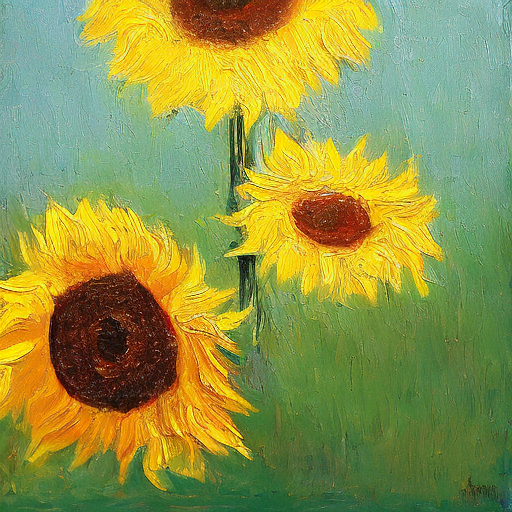
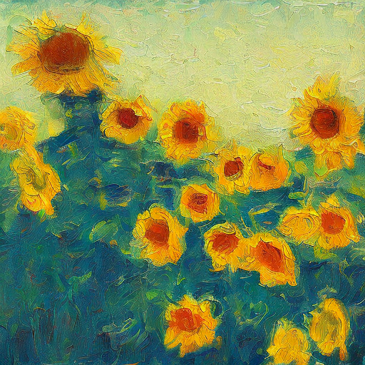

# Stablediffusionv2

## 目录

- [Stablediffusionv2模型](#Stablediffusionv2模型)
- [环境依赖](#环境依赖)
- [快速开始](#快速开始)
  - [准备checkpoint](#准备checkpoint)
  - [文图生成](#文图生成)
  - [生成样例](#生成样例)

## Stablediffusionv2模型

Stablediffusionv2模型由**Stability-AI**团队研发，由**华为昇腾**部门适配Mindspore+Ascend环境实现。

## 环境依赖

1. **昇腾软硬件解决方案(驱动+固件+CANN)**

   前往[昇腾社区](<https://www.hiascend.com/software/cann/commercial>)，按照说明下载安装。

2. AI框架 - **MindSpore** == 1.9

   前往[MindSpore官网](<https://www.mindspore.cn/install>)，按照说明下载安装。

   如需更多帮助，可以参考以下资料
   
   -  [MindSpore 教程](https://www.mindspore.cn/tutorials/zh-CN/master/index.html)
   -  [MindSpore Python API](https://www.mindspore.cn/docs/zh-CN/master/index.html)

3. **第三方依赖**

   ```python
   pip install -r requirements.txt
   ```

## 快速开始

### 准备checkpoint

下载stablediffusionv2预训练参数 [stablediffusionv2_512.ckpt](https://download.mindspore.cn/toolkits/minddiffusion/stablediffusion/stablediffusionv2_512.ckpt) 至 stablediffusion/models/ 目录.

对于微调任务，我们提供了示例数据来展示格式，点击[这里](https://opt-release.obs.cn-central-221.ovaijisuan.com:443/wukonghuahua/dataset.tar.gz)下载.

### 文图生成

要进行文图生成，可以运行txt2img.py 或者直接使用默认参数运行 infer.sh.

```shell
python txt2img.py --prompt [input text] --ckpt_path [ckpt_path] --ckpt_name [ckpt_name] \
--H [image_height] --W [image_width] --output_path [image save folder] \
--n_samples [number of images to generate]
```
或者
```shell
bash scripts/infer.sh
```

更高的分辨率需要更大的显存. 对于 Ascend 910 芯片, 我们可以同时生成4张512x512的图片。


### 生成样例

下面是我们的stablediffusionv2模型生成的一些样例以及对应的`[input text]`。

```
A Van Gogh style oil painting of sunflower
```



```
A Van Gogh style oil painting of sunflower
```



```
A Van Gogh style oil painting of starry sky
```


```
A Van Gogh style oil painting of starry sky
```


