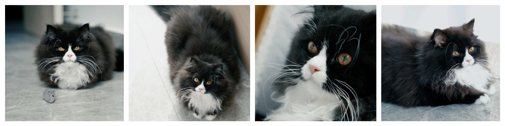
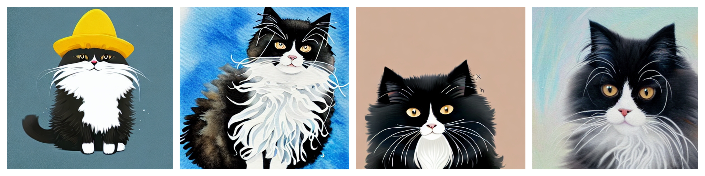

# 悟空画画

## 目录

[Check English](./README_EN.md)

- [Wukong-Huahua悟空画画模型](#Wukong-Huahua悟空画画模型)
- [环境依赖](#环境依赖)
- [快速开始](#快速开始)
  - [准备checkpoint](#准备checkpoint)
  - [文图生成](#文图生成)
  - [训练微调](#训练微调)
  - [生成样例](#生成样例)

## Wukong-Huahua悟空画画模型

Wukong-Huahua是基于扩散模型的中文文生图大模型，由**华为诺亚团队**携手**中软分布式并行实验室**，**昇腾计算产品部**联合开发。模型基于[Wukong dataset](https://wukong-dataset.github.io/wukong-dataset/)训练，并使用[昇思框架(MindSpore)](https://www.mindspore.cn)+昇腾(Ascend)软硬件解决方案实现。
欢迎访问我们的[在线体验平台](https://xihe.mindspore.cn/modelzoo/wukong)试玩。

## 环境依赖

1. **昇腾软硬件解决方案(驱动+固件+CANN)**

   前往[昇腾社区](<https://www.hiascend.com/software/cann/commercial>)，按照说明下载安装。

2. AI框架 - **MindSpore** == 1.9

   前往[MindSpore官网](<https://www.mindspore.cn/install>)，按照说明下载安装。

   如需更多帮助，可以参考以下资料
   
   -  [MindSpore 教程](https://www.mindspore.cn/tutorials/zh-CN/master/index.html)
   -  [MindSpore Python API](https://www.mindspore.cn/docs/zh-CN/master/index.html)

3. **第三方依赖**

   ```python
   pip install -r requirements.txt
   ```

## 快速开始

### 任务一：通用文生图任务


### 准备checkpoint

下载Wukong-Huahua预训练参数 [wukong-huahua-ms.ckpt](https://download.mindspore.cn/toolkits/minddiffusion/wukong-huahua/wukong-huahua-ms.ckpt) 至 wukong-huahua/models/ 目录.

对于微调任务，我们提供了示例数据来展示格式，点击[这里](https://download.mindspore.cn/toolkits/minddiffusion/wukong-huahua/dataset.tar.gz)下载.

#### 推理生成

要进行文图生成，可以运行txt2img.py 或者直接使用默认参数运行 infer.sh.

```shell
python txt2img.py --prompt [input text] --ckpt_path [ckpt_path] --ckpt_name [ckpt_name] \
--H [image_height] --W [image_width] --output_path [image save folder] \
--n_samples [number of images to generate]
```
或者
```shell
bash scripts/run_txt2img.sh
```

更高的分辨率需要更大的显存. 对于 Ascend 910 芯片, 我们可以同时生成2张1024x768的图片或者16张512x512的图片。

#### 训练微调

- 单卡微调

修改scripts/run_train.sh中相应配置

```shell
bash scripts/run_train.sh
```

- 多卡并行微调

修改scripts/run_train_parallel.sh中相应配置

```shell
bash scripts/run_train_parallel.sh [DEVICE_NUM] [VISIABLE_DEVICES(0,1,2,3,4,5,6,7)] [RANK_TABLE_FILE]
```

### 任务二：个性化文生图任务

能够基于3-5张同一主体的照片，经过25-35分钟的个性化微调，得到该主体定制化的图片生成模型。

训练数据：



效果展示,生成各种风格的主体图片：



#### 资源和数据准备

1. 下载Wukong-Huahua预训练参数 [wukong-huahua-ms.ckpt](https://download.mindspore.cn/toolkits/minddiffusion/wukong-huahua/wukong-huahua-ms.ckpt) 至 wukong-huahua/models/ 目录
2. 训练数据，3-5张同一主体的照片（训练照片规格为512*512，尽量选取单一干净的背景，主体突出）
3. 准备正则数据200张。如训练主体为狗，则需准备200张各种其他狗的图片，这些图片可以通过通用模型生成，也可以手动收集。提供了男人、女人、狗、猫四个类别的正则数据各200张。点击[这里](https://download.mindspore.cn/toolkits/minddiffusion/wukong-huahua/reg_data.rar)下载

#### 个性化微调

修改scrpts/run_db_train.sh中output_path（输出路径）、pretrained_model_path（预训练模型路径）、train_data_path（训练数据路径）、reg_data_path（正则数据路径，与训练数据主体类别对应）、class_word（训练数据主体类别）、token（训练主体标识符，可用默认）

```shell
bash scripts/run_db_train.sh
```

#### 个性化生成

增加scrpts/run_infer.sh中python脚本入参ckpt_path（微调好的ckpt保存的目录），ckpt_name（微调好的ckpt名称），修改prompt，格式最好为token+class_word+风格，如“α猫 插画风格”、“α猫 素描画风格”

```shell
bash scripts/infer.sh
```

### 任务三：图像编辑任务

### 准备checkpoint

下载Wukong-Huahua预训练参数 [wukong-huahua-inpaint-ms.ckpt](https://download.mindspore.cn/toolkits/minddiffusion/wukong-huahua/wukong-huahua-inpaint-ms.ckpt) 至 wukong-huahua/models/ 目录

#### 推理生成

要进行图像编辑，可以运行 inpaint.py 或者直接使用默认参数运行 run_inpaint.sh.

```shell
python inpaint.py --prompt [prompt] --img [origin image path] --mask [mask image path]
```
或者
```shell
bash scripts/run_inpaint.sh
```

### 效果展示
从左到右依次为原图、mask图、生成的4张图片
